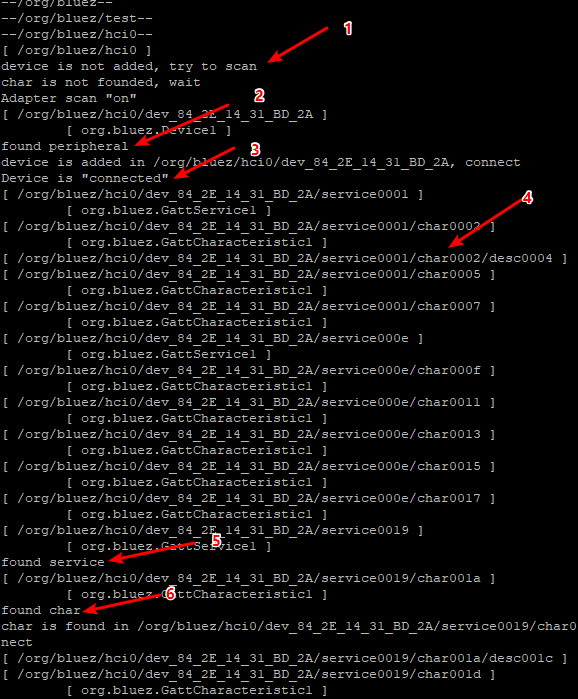
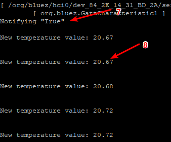
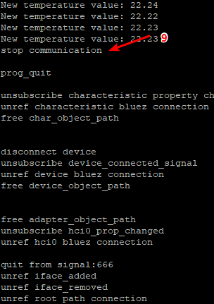

# Purpose
这个项目使用树莓派通过蓝牙连接Silabs BG22来传输温度值
# 硬件
树莓派3B+（BLE 4.2）作为主机，
BG22 Thunderboard烧录默认的Thermometer example作为从机，Thunderboard上默认带有温度传感器
# 软件
树莓派上使用DBus来开发蓝牙
    使用Simplicity studio烧录默认的Thermometer example到BG22上
# 测试步骤
    1. 树莓派上电
    2. BG22 Thunderboard上电
    3. 在树莓派上运行程序 ./bluez_connect_thermometer
    4. 下面的log截图可以看到通信的整个过程
        1. 开启扫描
        2. 发现设备
        3. 连接设备
        4. GATT discovery
        5. 发现服务
        6. 发现特征值
        7. 开启notify
        8. 接收到温度值
        9. 关闭连接

# Author
idle911@163.com

# Purpose
This project uses a Raspberry Pi connected to a Silabs BG22 via Bluetooth to transmit temperature values.
# hardware
Raspberry Pi 3B+ (BLE 4.2) as host,
    BG22 Thunderboard burns the default Thermometer example as a slave, and the Thunderboard has a temperature sensor by default.
# software
Using DBus on Raspberry Pi to develop Bluetooth,
    Use Simplicity studio to burn the default Thermometer example to BG22.
# Test steps
    1. Power on the Raspberry Pi
    2. Power on BG22 Thunderboard
    3. Run the program ./bluez_connect_thermometer on the Raspberry Pi
    4. We can see the entire communication process from above log screenshot.
        1. Start scanning
        2. Discover the device
        3. Connect the device
        4. GATT discovery
        5. Discovery services
        6. Find characteristic
        7. Turn on notify
        8. Receive temperature value
        9. Close the connection